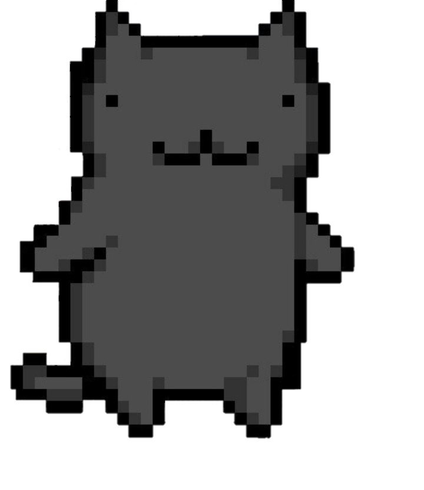

&nbsp;&nbsp;&nbsp;

<!-- 

 -->

I am Gautom Agarwal,

- I’m currently studying at MNNIT Allahabad 
- I’m currently learning Machine Learning 
- Fun fact: I love animals  and automobiles 

 

&nbsp;&nbsp;

